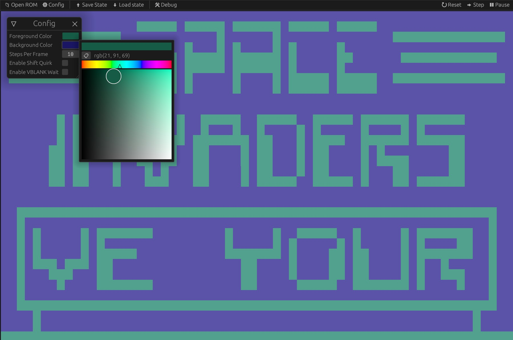

# CHIP-8


*Debug view of the interpreter, running the
[Space Invaders CHIP-8 ROM by David Winter](https://github.com/dmatlack/chip8/blob/aebb1ae08505d129e56ae61ee08d3193a29a2e1a/roms/games/Space%20Invaders%20%5BDavid%20Winter%5D.ch8)*

This is a [CHIP-8](https://en.wikipedia.org/wiki/CHIP-8) interpreter/emulator written in Rust.
CHIP-8 is an interpreted programming language for making simple graphical applications (usually games).
It originally ran on microcomputers.

This project was helpful in learning more about low level programming, and how computers work. 
It was also used as an introduction to emulator development, something that I am interested in exploring further.

## Features

 - Load ROMs using a file dialog.
 - Edit settings to change background and foreground colors, as well as the speed of the interpreter.
 - Save and load the CHIP-8 interpreter state to/from disk.
 - Debug CHIP-8 programs with a "debug view" that allows inspecting the interpreter state while the program is running.


*Using the save/load state feature of the interpreter while running the [Tetris ROM by Fran Dachille](https://github.com/dmatlack/chip8/blob/aebb1ae08505d129e56ae61ee08d3193a29a2e1a/roms/games/Tetris%20%5BFran%20Dachille,%201991%5D.ch8). Note that saving and loading states opens a file dialog to choose a file, so multiple save states are possible.*



*Changing the foreground and background colors of the interpreter's graphics running the 
[Space Invaders CHIP-8 ROM by David Winter](https://github.com/dmatlack/chip8/blob/aebb1ae08505d129e56ae61ee08d3193a29a2e1a/roms/games/Space%20Invaders%20%5BDavid%20Winter%5D.ch8)*

## Reflection

This is the first project where I opted to use a "message" system for the GUI to pass all 
state-changes as a message to a controller-like component for handling. I think this was a nice addition for the project
as all the GUI actions that mutated the backend state were now all handled in once place,
instead of being hidden throughout the GUI code.

One thing that I'd like to improve is the way interpreter instructions are handled.
Right now, each instruction is decoded and executed using a single `match` statement.
A potentially better way would be to encode each instruction as a Rust `struct`.
Each instruction object would contain a closure that would actually execute the instruction,
as well as any additional data, such as a display-friendly string to show the user what the instruction is doing.
Decoding of each instruction can be made more efficent by storing each `Instruction` object in a lookup table and indexing into it.

In the end, the extra efficiency doesn't really matter much for this interpreter.
However, since this was used a introductory learning experiment for creating emulators,
it would be good practice to implement the system in this interpreter to get a feel for it.

Another thing to improve is how internal Chip8 components, (e.g. memory, registers, and graphics) are accessed from the outside.
Right now, the internal components are all public so it can be accessed and mutated from anywhere.
However, it would be better to define some API in the `Chip8` object for interfacing with the components,
so that consumers of the API don't have to worry about the internal structure of the interpeter.
As well, any changes to the internal structure would minimally affect the consumers of the the API.

If I had more time, I would turn the debug view into more of an IDE of sorts.
Additional features could include the ability to add instructions to the program you've loaded,
and edit register and memory values on the fly.

## Running

Clone the repository:
```
git clone https://github.com/lainv10/chip8.git
cd chip8
```

Build and run the release build with [`cargo`](https://doc.rust-lang.org/cargo/):

```
cargo run --release
```
This will run the GUI with no CHIP-8 program loaded. You can load a CHIP-8 program
using the "Open ROM" button in the menu bar.
Alternatively, you can provide a CHIP-8 program to load on startup via the command line:
```
cargo run --release -- <path_to_program>
```

## Resources

 - [Cowgod's Chip-8 Technical Reference](http://devernay.free.fr/hacks/chip8/C8TECH10.HTM) 
    was a very helpful resource during the development of this interpreter.

 - [Timendus' CHIP-8 Test Suite](https://github.com/Timendus/chip8-test-suite)
    contained many useful tests for checking the correctness of the interpreter implementation,
    as well as information about several CHIP-8 quirks.